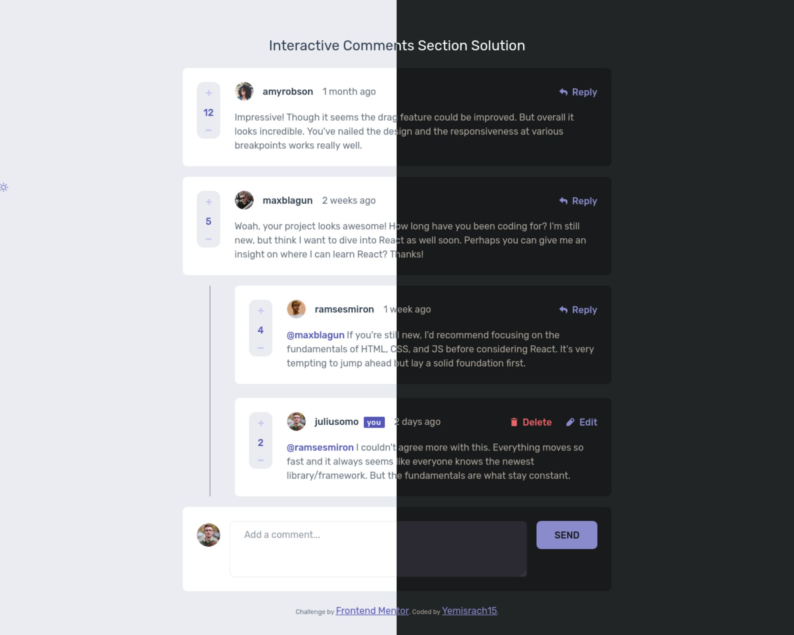

# Frontend Mentor - Interactive comments section solution

This is a solution to the [Interactive comments section challenge on Frontend Mentor](https://www.frontendmentor.io/challenges/interactive-comments-section-iG1RugEG9). Frontend Mentor challenges help you improve your coding skills by building realistic projects.

## Table of contents

- [Overview](#overview)
  - [The challenge](#the-challenge)
  - [Screenshot](#screenshot)
  - [Links](#links)
- [My process](#my-process)
  - [Built with](#built-with)
  - [Workflow](#workflow)
  - [What I learned](#what-i-learned)
  - [Continued development](#continued-development)
  - [Useful resources](#useful-resources)
- [Author](#author)

## Overview

### The challenge

Users should be able to:

- View the optimal layout for the app depending on their device's screen size
- See hover states for all interactive elements on the page
- Create, Read, Update, and Delete comments and replies
- Upvote and downvote comments
- **Bonus**: If you're building a purely front-end project, use `localStorage` to save the current state in the browser that persists when the browser is refreshed.
- **Bonus**: Instead of using the `createdAt` strings from the `data.json` file, try using timestamps and dynamically track the time since the comment or reply was posted.

### Screenshot



### Links

- [Solution URL](https://github.com/Yemisrach15/interactive-comments-section)
- [Live Site URL](https://interactive-comment-section-tawny.vercel.app/)

## My process

### Built with

- Semantic and accessible HTML5 markup
- CSS Grid layout
- Mobile-first workflow
- [Sass](https://sass-lang.com/) - CSS extension language
- [React](https://reactjs.org/) - JS library
- [TypeScript](https://www.typescriptlang.org/)
- [Recoil](https://recoiljs.org/) - State management library

### Workflow

Upon seeing the design preview for this project, I realized building simple components and connecting them would be a good approach. That's why I decided to use react since it's a well known library that is suited for component based architecture. From previous experience, I knew building it with typescript would make the development flow smoothly and catch most bugs early on. I used recoil for managing state throughout the app because I wanted to add a new skill to my portfolio and it turns out it's really easy to get started with. All the abstract concepts in redux such as reducers are impeding but with recoil if you know how to use `useState`, you are good to go (Of course, this doesn't mean there is nothing new to learn. It helps knowing how it works behind the scenes) 

The first thing I did when starting the project is setting up a CI/CD pipeline with github actions. What it basically does is build the project and deploy it to [vercel](https://vercel.com/) on every pull request created and on every push to the main branch. This enables me to make sure the deployed version and my local running version are the same and nothing is broken. It helps avoid unpleasant surprises later when deploying after the project is done. This is more of a devops job but if you want to customize the default behavior of vercel integration for github which only deploys on push to main branch, you need to write your own workflow file. I have written an article on [medium](https://medium.com/@Yemisrach15/setting-up-ci-cd-with-github-actions-and-vercel-486b31ebb874) if you want more insight on how I setup my workflow.

With [prettier](https://prettier.io/) and [eslint](https://eslint.org/), the code is ensured to have a consistent format. No using two tabs on one IDE and four tabs on another IDE. [Husky](https://typicode.github.io/husky/#/), a library for git hooks, lints the code before commiting and runs and ensures tests pass before pushing.

I started writing the code by building basic building blocks like the buttons, comment input forms, modal, etc... I then constructed the whole UI using these basic components, populated the page with the given json data, and added the create, edit, and delete functionalities. While doing so I made sure each component was accessible according to the WCAG guidelines. In addition, I tested the overall accessibility with the free version of [axe DevTools](https://deque.com/axe/devtools/) and [WAVE](https://wave.webaim.org/) browser ad-ons. 

The `sass` folder turned out to be unmaintainable so I resorted to the [7-1 pattern](https://sass-guidelin.es/#architecture) to organize `sass` files. I also made some UI/UX enhancements like dark theme which I saw fit, as a developer. 

Throughout the duration of this process, I used github projects, issues, and pull requests extensively. Take a look at the [issues resolved](https://github.com/Yemisrach15/interactive-comments-section/issues?q=is%3Aissue+is%3Aclosed+sort%3Acreated-asc) until now. I plan to continue using this method on future projects. 

### What I learned

There's a lot I learned while doing this project ranging from basic HTML elements/tags to github actions. I dug through MDN, Web Content Accessibility Guidelines (WCAG), [ARIA Authoring Practices Guide(APG)](https://www.w3.org/WAI/ARIA/apg/patterns/), reactjs, sass, recoiljs, github, and vercel documentations. Here are a few lessons learned. 
- *Difference between dialog and modal* - Content behind open dialog can be interactive whereas content behind open modal should not be interactive. A modal is more like an alert. Without taking actions the modal requires you to, you can't interact with any other content of the page. 
- *Use width and height to mitigate content layout shift on images* - If an image has a width and height attribute, browser reserves space until the image loads. 
- *Passing tag/element name as react prop* - While building the components, it became evident I was on the way to creating one for every tag. I researched and found [an article](https://dev.to/enetojara/create-custom-html-components-react-3537) which enlightened me. To show an example, I call a component as followed which creates a span element
	```js
	<Text tag="span">Hello world</Text>
	``` 
	Inside the `Text` component, the `tag` prop is renamed to `Tag` with uppercase *t* when destructuring and is then called as a typical component. React interprets lowercase components as native HTML tags. If `tag` prop had not been renamed, we would get an element with name `tag` in the DOM. 
	```js
	function Text({ children, tag: Tag }) {
		return <Tag>{children}</Tag>;
	}
	``` 
- *Screen reader only texts for icons* - I used a css snippet from [a11yproject.com](https://www.a11yproject.com/posts/how-to-hide-content/) to add text alternatives for icon buttons and inputs which are inaccessible to visually impaired users. 
- *Logical ordering of content in grid layout* - [On MDN doc](https://developer.mozilla.org/en-US/docs/Web/CSS/CSS_Grid_Layout/CSS_Grid_Layout_and_Accessibility#re-ordering_content_in_css_grid_layout), I found out although content can be rearranged visually, it must not affect the logical ordering of the content for non-visual users. I took this into consideration when building the comment box component. The mobile version seemed the most logical way of arranging the content within the comment box so I wrote the HTML by referring the mobile design. 
- *Accessible modals* - According to [ARIA Authoring Practices](https://www.w3.org/WAI/ARIA/apg/patterns/dialogmodal/), a modal should close on `esc` keyboard click, should by default focus on the first focusable element, trap tab order within itself until closed, and should return focus to last focused element that triggered it to open. Some were by default done when using `dialog` HTML element so I utilized the new tag. To trap focus within the modal, I used a npm package [focus-trap](https://www.npmjs.com/package/focus-trap-react) which was available for react and it worked well. 

### Continued development

- I have been putting off writing tests though I had it in mind at the beginning of this project. 
- `createdAt` property needs to be changed to timestamp as second bonus says. 

### Useful resources

- [Josh Comeau's blog](https://www.joshwcomeau.com) - Josh has excellent articles on react and css. 
- [Accessible widgets](https://www.w3.org/WAI/ARIA/apg/patterns/) - This is an amazing resource which helped me build an accessible modal. 
- [How to test for web accessibility](https://www.a11y-collective.com/how-to-test-for-web-accessibility-an-introduction/#main-content) - A great simplified introduction on building accessibile websites

## Author

- Frontend Mentor - [@Yemisrach15](https://www.frontendmentor.io/profile/Yemisrach15)
- GitHub - [@Yemisrach15](https://github.com/Yemisrach15)
